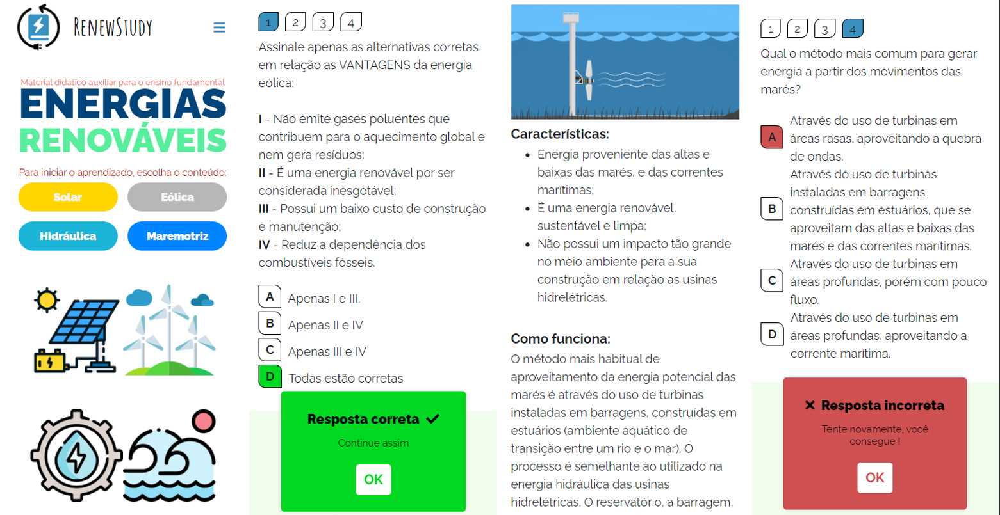

<h1 align="center"> Renewstudy </h1>

    

<h3 align="center">Um website que disponibiliza um material didático auxiliar para o conteúdo de energias renovaveis destinado principalmente para o Ensino fundamental II</h3>

## Conteudo

O material é constituido a partir de um conteúdo acessível, ou seja, de fácil entendimento, que possui um breve questionário para cada tema:

- Energia solar
- Energia eólica
- Energia hidráulica
- Energia maremotriz

## 📱 Construção

- Html, Css e Javascript
- JQuery
- Bootstrap 4
- Sweetalert 2

## 📃 Licença

[MIT License.](LICENSE)